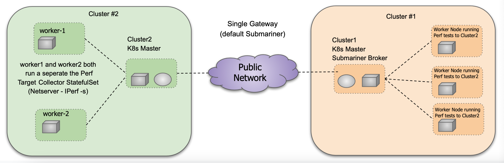

# Kubernetes/Submariner Custom Image Performance Testing Single Gateway (Current Upstream)
- TLDR; specify the custom images repo and the custom subctl binary build in `vars.yml`
- A daemonset for Cluster-1 worker nodes is provisioned for polling of the exported netserver StatefulSettefulset running in Cluster-2 and exported via Submariner in Globalnet. This is all automated.
- The topology and performance traffic flow is depicted in the following diagram:

<p align="center">

</p>

- The specific topology looks like the following. The number of worker nodes running conn current performance tests is set in the `vars.yml` file `node_count`.

<p align="center">

</p>

### Quickstart for multi-cluster, single gateway, multi-worker

- Edit `ansible.cfg` adding in the relevant information. For the Axon group, `private_key_file` in
  `ansible.cfg` in vars.yaml is the main field to change is the location of the perf testing private key.
  Put the private key in the same directory as ansible.cfg or specify the path and set the key permissions
  .e.g. `chmod 0400 axon-perf-testing.pem`
- One broker node and one secondary gateway nodes are spawned in the same cluster.
- In `vars.yml` the `node_count:` key specifies how many worker nodes are spawned.
- The broker node is also the k8s master node for the cluster.
- broker-info.shim and k8s server tokens are stored in the base directory.

```sh
ansible-vault create credentials.yml
```

- Setup the EC2 nodes by running the playbook and specify the host root password when asked for `BECOME PASSWORD` and then supply your
  vault password when asked.

This will result in:
- 1x broker node also running as the k8s master
- 1x secondary gateway node running as a k8s worker
- (n)x k8s worker nodes, n=node_count value specified in `vars.yml`

```sh
ansible-playbook --ask-vault-pass setup-ec2.yml
```

- Next deploy the k8s/submariner playbooks:
- TODO: this last step is still a WIP. Kubeconfig needs to be copied down from the master note to the submariner secondary gateway in order to run submariner pods.

```sh
ansible-playbook setup-k8s.yml
```

- Once the playbooks are finished, look for the output of the Ansible task that provides the Grafana web address.
- The Grafana/Graphite collector can also be a separate standalone service. By adding the env `external_grafana_collector` to `vars.yml` an instance will not be provisioning by the plays.

```
TASK [deploy-grafana : Display the Grafana Public URL] 
ok: [54.172.231.57] =>
  msg: Grafana URL is at http://54.172.231.57
```

Copy the json in [grafana-dashboard.json](./grafana-dashboard.json) and paste it into a new dashboard by clicking the + and then import in the Grafana splash page:


- Debug netperf and tsdb exports by looking at the cloud bandwidth logs by SSHing to the `cluster1brokerNode` (ex. `ssh -i ./axon-perf-testing.pem fedora@x.x.x.x`) in the `ip.txt` file like so:

```shell
export KUBECONFIG=/home/fedora/config
kubectl logs cloud-bandwidth-netperf-ds-n96zp -n kube-system
``` 

### Verbose Setup

- This setup installs the specified number of k8s clusters, installs submariner and joins them to the broker.
- More details on pre-requisites of the setup can be found at [Kubernetes Multi-Node Ansible Deployment for AWS EC2](https://github.com/nerdalert/aws-ansible-kubernetes/blob/main/README.md).

```sh
# The following will open an editor
ansible-vault create credentials.yml

# Paste the following in the opened editor and save the file
access_key: <add_access_key_here>
secret_key: <add_secret_key_here>
```

- Adjust the `ansible.cfg` file in the base directory to reflect your environment.
- The main one that needs to be edited for your environment will be the path to the
  `private_key_file.pem` entry that is associated with your AWS key specified in `vars.yml`.
  You can also simply copy the key to the base directory and leave off the path.
- In some environments you won't need to enable `become_ask_pass` but adding it to be as
  agnostic as possible to all installations.

```yaml
[defaults]
        # this is an default inventory location, user can change it accordingly
  host_key_checking = false
  deprecation_warnings = false
  ask_pass = false
  stdout_callback = yaml
  remote_user = fedora
        # defaults to the base directory in the project
  inventory = ip.txt
        # create .pem private_key_file and provide location
  private_key_file = <aws_private_key_name>.pem

        [privilege_escalation]
  become = true
  become_method = sudo
  become_user = root
  become_ask_pass = true
```

- Next set the environmentals for your AWS EC2 details in `env.yaml` located in the base
  of the project. Here are some example values.

```yaml
aws_region: us-east-1                 # AWS region
vpc_id: vpc-xxxxxxxx                  # VPC id from your aws account
aws_subnet: subnet-xxxxxxxx           # VPC subnet id from your aws account
aws_image_id: ami-08b4ee602f76bff79   # Fedora 35 (this can be changed to most any Linux distro)
aws_key_name: <ec2-keypair_name>      # the key pair on your aws account to use
aws_instance_type: t2.xlarge          # t2.micro is free tier eligible, but you can use any type to scale up, more examples [t2.large, t2.xlarge, t2.2xlarge]
ansible_user: fedora                  # this is the default user ID for your AMI image. Example, AWS AMI is ec2-user etc
node_count: 14                        # the number of cluster nodes you want to deploy
secgroup_name: perf_testing_secgroup  # the security group name can be an existing group or else it will be created by the playbook
security_group_description: "Perf Testing for VPC perf-testing-vpc / vpc-0566e09aa71f553c1"
inventory_location: ip.txt            # leaving this as is will use the ip.txt file in the base directory
external_grafana_collector:           # external graphite tsdb/grafana instance rather than the playbooks provisioning one for persistant records
submariner_cable_driver: vxlan        # [vxlan, libreswan, wireguard]
submariner_cluster_cidr_cluster1: 10.70.0.0/16
submariner_service_cidr_cluster1: 10.75.0.0/16
submariner_cluster_cidr_cluster2: 10.80.0.0/16
submariner_service_cidr_cluster2: 10.85.0.0/16

```

### Run the installation

- Once your `env.yaml` is setup for your EC2 environment, you are ready to run the playbook to deploy the EC2 instances.
  This will create the VMs for the deployment (add -vv for verbose output).

```sh
$ ansible-playbook --ask-vault-pass setup-ec2.yml
# host being run from su password (may not be required in some setups, can disable in ansible.cfg)
BECOME password:
# password when you created the ansible vault
Vault password:
```

- After that run is complete, you can always ping the nodes to verify connectivity by running the following from the base directory:

```sh
ansible all -m ping
```

```sh
ansible-playbook setup-ec2.yml
```

- You can double check connectivity to the new nodes with:

```sh
# This pings all of the hosts in your ip.txt file 
ansible all -m ping
```

- Once your nodes are running, deploy K3s Kubernetes to the nodes listed in your inventory file `ip.txt` by running the playbooks in `setup-kubernetes.yml`

```
ansible-playbook setup-k8s.yml
```

Assuming that runs with no issues, your k8s/submariner deployment is up and running.
- The `broker-info.subm` file used with all joins is copied to the local machine  
  from the initial broker node installation and then copied to all cluster nodes for
  their join.
- The kube server join token is copied to the local directory if you want to attach
  worker nodes to any of the clusters.

### Verify the Kubernetes/Submariner Deployment

You can find the addresses for the installed nodes in `ip.txt`, for example:

```yaml
[cluster1brokerNode]
  34.239.124.181 ansible_user=fedora ansible_connection=ssh k8s_master=10.10.0.15 hostname=cluster1-ha1-fed

        [cluster2Master]
  3.95.5.149 ansible_user=fedora ansible_connection=ssh k8s_master=10.10.0.15 hostname=cluster2-perf-target-fed

        [cluster1WorkerNodes]
  34.239.127.237 ansible_user=fedora ansible_connection=ssh k8s_master=10.10.0.15 hostname=cluster1-worker5-fed
  44.203.194.156 ansible_user=fedora ansible_connection=ssh k8s_master=10.10.0.15 hostname=cluster1-worker4-fed
  44.203.127.134 ansible_user=fedora ansible_connection=ssh k8s_master=10.10.0.15 hostname=cluster1-worker3-fed
  44.202.134.79 ansible_user=fedora ansible_connection=ssh k8s_master=10.10.0.15 hostname=cluster1-worker2-fed
  54.211.58.60 ansible_user=fedora ansible_connection=ssh k8s_master=10.10.0.15 hostname=cluster1-worker1-fed

        [cluster2Worker1Node]
  3.82.150.153 ansible_user=fedora ansible_connection=ssh k8s_master=10.10.0.10 hostname=cluster2-worker1-fed
...

```

- Connect and verify the Submariner installation:

```
# ssh to the master node. you can look in ip.txt for the ip address
ssh -i ./<aws-private-key>.pem  fedora@<any_cluster_address_from_inventory>

# export the kube config
export KUBECONFIG=config

# view submariner status pods
subctl show all
Cluster "default"
 ✓ Detecting broker(s)
NAMESPACE                NAME                     COMPONENTS
submariner-k8s-broker    submariner-broker        service-discovery, connectivity

 ✓ Showing Connections
GATEWAY                CLUSTER                  REMOTE IP      NAT  CABLE DRIVER  SUBNETS        STATUS     RTT avg.
172-31-28-249-cluster  172-31-28-249-cluster-c  172.31.28.249  no   vxlan         242.4.0.0/16   connected
172-31-21-152-cluster  172-31-21-152-cluster-c  172.31.21.152  no   vxlan         242.1.0.0/16   connected
```

You are all set from there, feel free to leave feedback, open issues and/or PRs!
